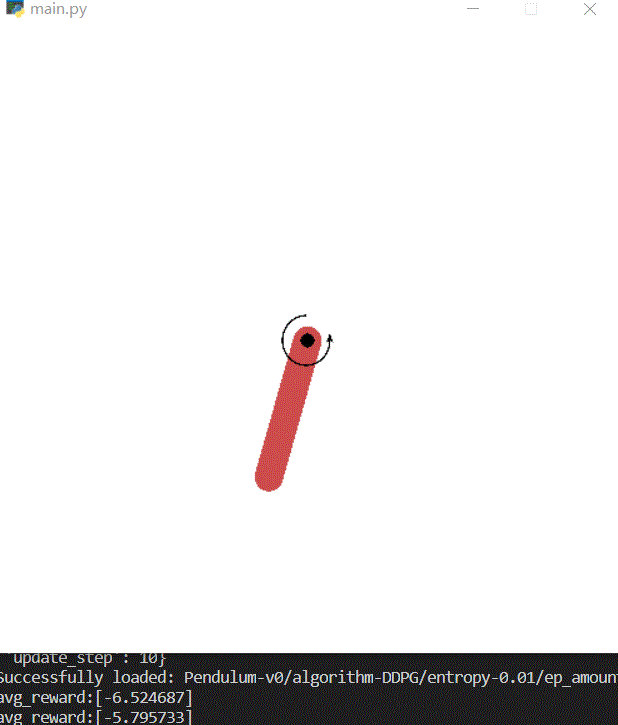
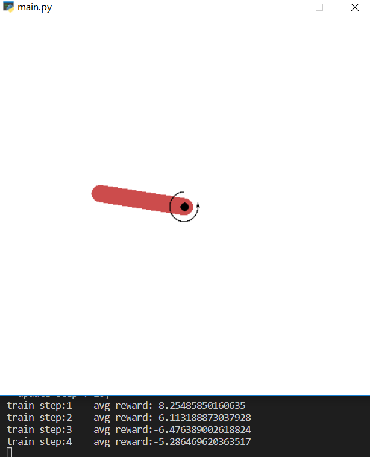
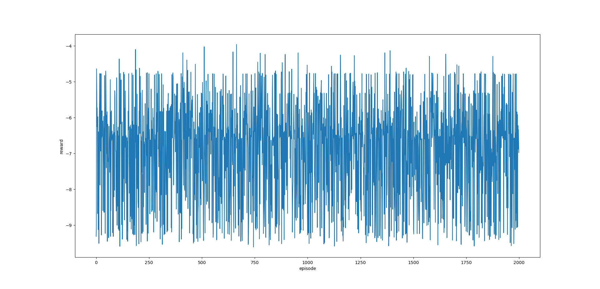

## Pendulum(A3C&DDPG)

### 1. Files

This experiment is based on the Pendulum-v0 environment in the `env.py`.

The global configurations are in the `configs.py`.

The agents with A3C and DDPG are both based on an abstract class in the `agent.py`. 

The A3C algorithm is implemented in the `a3c.py`.

The DDPG algorithm is implemented in the `ddpg.py`.

The file `ou_process.py` is for DDPG algorithm implementation.

The entry is in the `main.py`.

### 2. Results

#### 2.1 Asynchronous Advantage Actor-Critic (A3C) 

The A3C algorithm is implemented in tensorflow and it can converge in less than 500 steps in Pendulum-v0 environment. The `A3CAgent` inherits an abstract class `Agent` in the `agent.py`. The optimizer is RMSPropOptimizer and the learning rate is set  to 0.001 for critic and 0.0001 for actor. The discount $\gamma$ is set to constant 0.99. I also add an entropy loss regularization term for actor to encourage exploration as the paper recommends.  I run four agents in paralell to update the global network every 10 steps asynchronously. I change the parameters of the network according to the training process. I finally train the tuned network with 10000 episodes.

To test the model, use

``` shell
python main.py --algorithm=A3C --is_train=False
```

You could read the reward and learn the result as the following figure shows.


To train a model, use

```bash
python main.py --algorithm=A3C --is_train=True
```

Here are some screenshots of the training process


The reward is plotted as follows. And we can find the reward increases as the episode increases, although the variance grows, too.  

 

#### 2.2 Deep Deterministic policy gradient (DDPG) 

As for `DDPGAgent`, it is implemented in tensorflow, too. It inherits the same abstract class `Agent` as  `A3CAgent`. The optimizer is RMSPropOptimizer and the learning rate is set  to 0.001 for critic and 0.0001 for actor. The discount $\gamma$ is set to constant 0.99. I use the Ornstein-Uhlenbeck process to add temporally-correlated noise to the action space during training for exploration purposes. The  Wiener process in the Ornstein-Uhlenbeck process is carried by a Gaussian process (see `ou_process.py` for details).  I only make a few experiments on DDPG and train the network in 2000 episodes.

To test the model, use

``` shell
python main.py --algorithm=DDPG --is_train=False
```

You could read the reward and learn the result as the following figure shows. It seems that DDPG doesn't learn a good policy due to the shortage of the enough training process (since I only train it for 2000 episodes).



To train a model, use

```bash
python main.py --algorithm=DDPG --is_train=True
```

Here are some screenshots of the training process



The reward is plotted as follows. Compare with A3C reward, we can find that it doesn't learn anything in fact. Maybe I should change some parameters.

 

### 3. Details

We can use the arguments to change the configuration of the model. Here are the arguments in the `main.py`

|     argument      |                 help information                  | default |
| :---------------: | :-----------------------------------------------: | :-----: |
|    --algorithm    |                  Use A3C or DDPG                  |   A3C   |
|     --display     |       Whether to do display the env or not        |  True   |
|    --is_train     |             Whether to train or test              |  True   |
|    --ep_amount    |              Maximum episode amount               |  2000   |
| --store_after_eps |            How many episodes to store             |   100   |
|    --discount     |       The discount gamma for future reward        |  0.99   |
|    --actor_lr     |              Learning rate for actor              | 0.0001  |
|    --critic_lr    |             Learning rate for critic              |  0.001  |
|   --test_times    |           Experiment times when testing           |   50    |
|    --max_step     |              Max steps in an episode              |   200   |
|   --batch_size    |                    Batch size                     |   32    |
|   --update_step   | (A3C) How many steps to update the global network |   10    |
|     --entropy     |          (A3C) Entropy loss term weight           |  0.01   |
|   --multi_agent   |       (A3C) How many agents are paralleled        |    4    |
|     --memory      |              (DDPG) The memory size               | 1000000 |
|      --noise      |  (DDPG) The noise range over action space range   |   0.1   |
|       --l2        |       (DDPG) L2 regularization term weight        |    0    |

I record three parameters during experiment. They are `algorithm`, `entropy` and `ep_amount`. The trained model are saved under the corresponding directory. 

A3C and DDPG, these two algorithms, are implemented based on a common abstract class, which is extracted from the DQN implemented before. Thus, they are supplied with the same interface to train and test by simply call the `train()` and `test()`.

A3C use plenty of critics running asynchronously to weaken the correlation during the training process, while the DDPG follow the method taken by DQN and introduce the experience replay to weaken the correlation. A3C add an entropy loss term to the actor to encourage the exploration process, while the exploration of DDPG is guaranteed by adding random noise at the time to make decision. Exploration is especially important for DDPG since it's an algorithm with deterministic policy. If we don't explore more at the beginning, the algorithm will converge to a local minima.