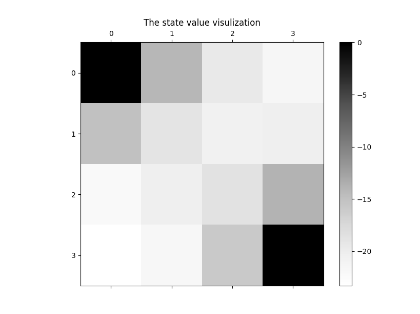

## Small Gridworld (Monto Carlo & Temporal Difference)

### 1. Files

This experiment is based on the framework built last week in the first homework.

The global constants are in the `config.py`

The gridworld environment is implemented in the `GridWorld.py`.

The Monto Carlo Method is implemented in the `MC.py`.

The Temporal Difference is implemented in the `TD.py`

### 2. Results

The selected policy is still the random policy and the $\gamma$ is set to 1. The other parameters of the Gridworld are not changed, which makes it convenient to compare these two methods with the result of Policy Evaluation in the first homework. The results are shown as follows. And they are very similar to the Policy Evaluation results.

Input

```shell
python ./MC.py --ite=400
```

in a shell and we can get these outputs:




Then input

```python
python ./TD.py --ite=400 --alpha=0.1
```

We will get


I can also assign other arguments to verify the generalization of these two algorithms, which will be discussed in the next part.

### 3. Details

Based on the framework built last week, I add Monto Carlo and Temporal Difference methods to Gridworld. The environment and two algorithms are also implemented as three seperate classes.

Different from the last homework, this time we didn't know the global information. To simulate a random action, we have to generate a random number according to the given policy. I first get a random number between 0 and 1, and set this number as a threshold.  Then I cumulate the probability of each action, and compare it with the threshold. Once the threshold is reached, return the action. 

When implement Monto Carlo method, we need to generate an episode first, which ends up with terminal states. That is,

<center> $$S_1,A_1,R_2,S_2,\ldots,S_T \sim\pi,$$ </center>

where $S_T$ is a terminal state. For each state, the return is the total discounted reward in the following equation,

<center> $$G_t=R_{t+1}+\gamma R_{t+2}+\ldots+\gamma^{T-1}R_T.$$ </center>

Since in Gridworld each step yields the same reward (-1), we can simply sum up the rewards after a state in an episode according to the $\gamma$ . In another word,

<center> $$G_t=\begin{cases} nR, & \gamma=1. \\ \frac{1-\gamma^n}{1-\gamma}R, & \gamma\neq1. \\ \end{cases}$$ </center>

I aslo use the increment Monto Carlo updates to save the memory waste. And it is described in the following formular,

<center> $$V(S_t) \larr V(S_t) + \frac{1}{N(S_t)}(G_t-V(S_t)).$$ </center>

As for Temporal Difference method, though it needs only two states in an episode if we only consider TD(0), I generate a complete episode as in the Monto Carlo method. And only consider each state and the state after it in the episode, which is shown in the following equation,

<center> $$G_t = R_{t+1}+\gamma V(S_{t+1}),$$ </center>

<center> $$V(S_t) \larr V(S_t) + \alpha(G_t-V(S_t)),$$ </center>

where $\alpha​$ is a parameter to control the step size.

The `argparse ` library is used to parse the arguments from the terminal. These arguments can also be referred direcly when we create a new object instance by construction function.

The supplied argument are as follows:

For GridWorld, the same as last homework

| argument |             help information             | default |
| :------: | :--------------------------------------: | :-----: |
| --gamma  |              the grid size               |    4    |
| --target | the discount for future expected rewards |    1    |
|  --grid  |           the target position            |   []    |
| --reward |            the future reward             |   -1    |

For Monto Carlo and Temporal Difference methods

| argument |        help information        | default |
| :------: | :----------------------------: | :-----: |
| --alpha  | the step size (only for TD.py) |  0.01   |
|  --ite   |       maximum iterations       |   100   |

Since these two methods are both based on the experience, which yield an emprical inference on the state value function. I found the result is not so stable. However, we can still find the relative relationships between different states. 


What's more, in the slides, the alpha (step size) in Temporal Difference method is recommended to be set as 1. But I found it seems to be better to use 0.1 to 0.2 in this GridWorld Problem.