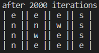
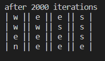
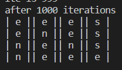
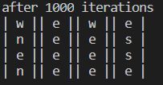
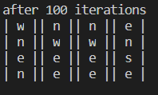

## Cliff Walking (Sarsa & Q-Learning)

### 1. Files

This experiment is based on the CliffWorld environment in the `CliffWorld`.

The global constants are in the `configs.py`

The CliffWorld environment is implemented in the `CliffWorld.py`.

The Sarsa algorithm is implemented in the `Sarsa.py`.

The Q-Learning algorithm is implemented in the `QL.py`.

### 2. Results

Since the Cliff Walking environment is without the discount. The $\gamma$ is set to constant 1. To reduce the time to converge, the Cliff World is set samller than the Grids in Figure 1 in the assignment. It is a $4\times 4$ grids world with two grids of the bottom line being the cliff.  The maximum iteration is set to 2000 by default. The step size $\alpha$ is set to 0.1 and the $\epsilon$ of the $\epsilon$ -greedy is set to 0.1.

We update the action-value function during the iteration. In the end, we select the best policy according to the action-value function.

The results are shown as follows. 

Input

```shell
python ./Sarsa.py 
```

in a shell and we can get these outputs:



We can find that the optimal policy is the same as the expected ones. The Sarsa algorithm finally recommends a safer path. (Start at the (3,3), then follow the path (3,0,north)->(2,0,north)->(1,0,north)->(0,0,north)->(1,0,east)->...->(2,3,south)->(3,3). The character in the grid represent the direction to move when you are in this grid. Some of the grids won't be reached.)

Then input

```shell
python ./QL.py
```

We will get



We can also assign other arguments to verify the generalization of these two algorithms, which will be discussed in the next part. We will also compare these two algorithms in the next part.

### 3. Details

The Sarsa algorithm updates the action-value function by

<center>$Q(S,A) \larr Q(S,A)+\alpha[R+\gamma Q(S',A')-Q(S,A)],$</center>

where the $A'$ is the action selected by $\epsilon$-greedy method.  And $A'$ will be set as the action for the next state $S'$.

The Q-Learning algorithm updates the action-value function by

<center>$Q(S,A) \larr Q(S,A)+\alpha[R+\gamma Q(S',A')-Q(S,A)],$</center>

where the $A'$ is the action selected by utilizing greedy method directly.  And $A'$ will not be set as the action for the next state $S'$. We will use $\epsilon$-greedy method to select another action for state $S'$.

The supplied argument are as follows:

For CliffWorld

|  argument  |          help information          | default |
| :--------: | :--------------------------------: | :-----: |
| -- gridRow |        the grid size (Row)         |    4    |
| -- gridCol |        the grid size (Col)         |    4    |
| --rNormal  | the future reward for normal grids |   -1    |
| -- rCliff  | the future reward for Cliff grids  |  -100   |

For Sarsa and Q-Learning methods

| argument  |  help information  | default |
| :-------: | :----------------: | :-----: |
|  --alpha  |   the step size    |  0.01   |
|   --ite   | maximum iterations |   100   |
| --epsilon |  exploration rate  |  0.01   |

When we degree the iteration times to 1000, we can find Q-learning still return a stable answer, while the Sarsa sometimes gives wrong answer, which even leads us out of the grid world!

Input

```shell
python ./Sarsa.py --ite=1000
```

in a shell and we can get these outputs:



We can find that the answer is different from the 2000 times.

Then input

```shell
python ./QL.py --ite=1000
```

We will get



In fact, even in 100 iterations, QL is stable enough to give the shortest path ((3,0,north)->(2,0,east)->(2,1,east)->(2,2,east)->(2,3,south)->(3,3)).

